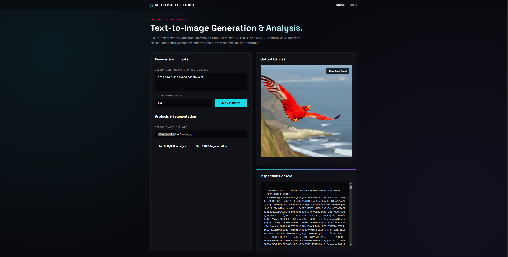
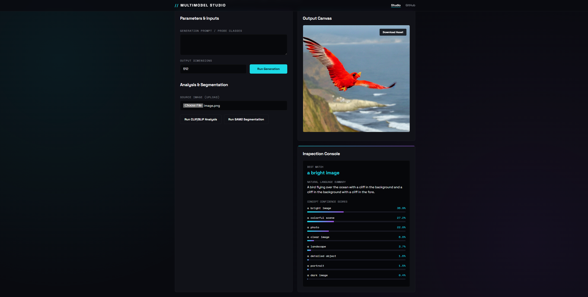
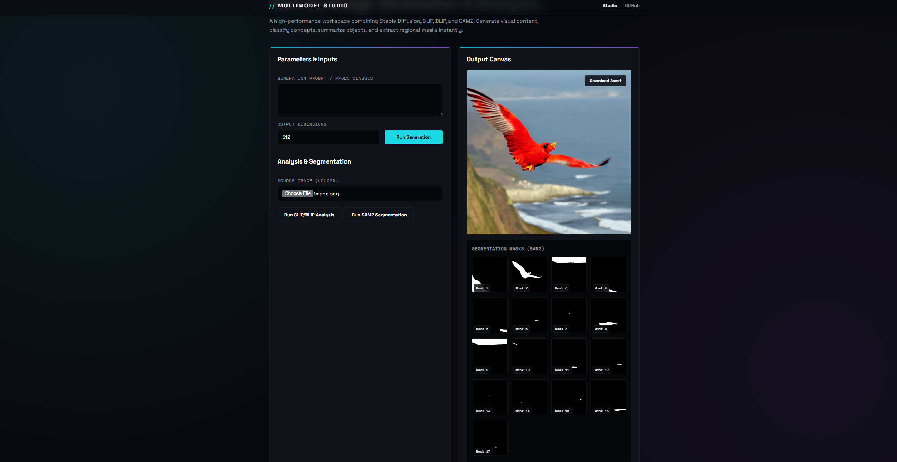
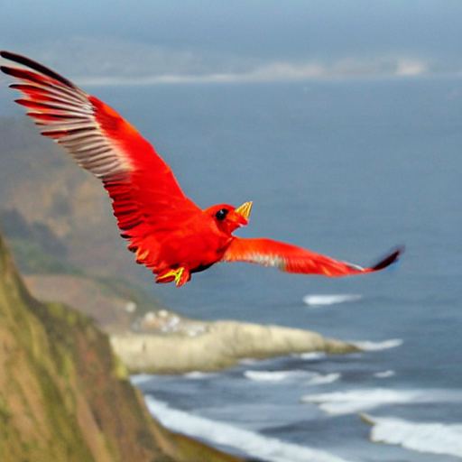

# Text-to-Image Generation with Multi-Model Analysis

Generate images from text descriptions using Stable Diffusion, analyze them using CLIP and BLIP, and perform instance segmentation using Meta's Segment Anything Model 2 (SAM2).

## Hardware Setup

This project is optimized for the following high-performance architecture:
- **CPU:** Intel(R) Xeon(R) Platinum 8559C
- **RAM:** 124 GB
- **GPU:** NVIDIA RTX PRO 6000 Blackwell Server Edition
- **VRAM:** 96 GB

### Installation (GPU Only)

1. Navigate to the project and activate your environment:
```bash
cd text-to-image-multimodel-analysis
conda activate deeplearning
```

2. Install dependencies:
```bash
pip install -r requirements.txt
pip install torch torchvision torchaudio --index-url https://download.pytorch.org/whl/cu121
```

3. Download Models:
Run the download script to fetch Stable Diffusion, SAM2, CLIP, and BLIP:
```bash
python download_models.py
```

## Running the Application

Start the FastAPI server:
```bash
cd src
python -m uvicorn main:app --host 127.0.0.1 --port 8000
```

### Browser UI
Open `http://127.0.0.1:8000/` in your browser for a fully interactive Multi-Model Studio UI. You can generate images, analyze uploads, and view segmentation masks directly.

### UI Previews

Below are visual examples of the Multimodel Studio interface in action:

#### 1. Image Generation (Stable Diffusion)


#### 2. Image Analysis (CLIP & BLIP)


#### 3. Instance Segmentation (SAM2)


#### 4. Download Preview Asset


## API Documentation

### 1. Generate Image (`POST /generate`)
Generates an image from a prompt, performs CLIP/BLIP analysis, and extracts SAM2 segmentation masks.

**Example Request:**
```bash
curl -X POST http://127.0.0.1:8000/generate \
  -H 'Content-Type: application/json' \
  -d '{"prompt":"a red kite flying over a coastal cliff", "image_size": 512}'
```

Response schema follows the structure in [example_generate_response.json](examples/example_generate_response.json).

### 2. Analyze Image (`POST /analyze`)
Analyzes an existing image using CLIP and BLIP, and runs SAM2 segmentation.

**Example Request:**
```bash
curl -X POST http://127.0.0.1:8000/analyze \
  -H 'Content-Type: application/json' \
  -d '{"image_base64":"iVBORw0KGgoAAAANSUhEUgAAAAEAAAABCAYAAAAfFcSJAAAADUlEQVR42mNk+M9QDwADhgGAWjR9awAAAABJRU5ErkJggg==", "prompt":"coastal, cliff"}'
```

Response schema follows the structure in [example_clip_response.json](examples/example_clip_response.json).

### 3. Segment Image (`POST /segment`)
Performs SAM2 segmentation on an uploaded image, returning masks and regions of interest.

**Example Request:**
```bash
curl -X POST http://127.0.0.1:8000/segment \
  -H 'Content-Type: application/json' \
  -d '{"image_base64":"iVBORw0KGgoAAAANSUhEUgAAAAEAAAABCAYAAAAfFcSJAAAADUlEQVR42mNk+M9QDwADhgGAWjR9awAAAABJRU5ErkJggg=="}'
```

Response schema follows the structure in [example_sam2_response.json](examples/example_sam2_response.json).

*Note: The base64 string in the examples above represents a minimal 1x1 black pixel PNG image, which you can use to quickly test the endpoints.*

## Model Configurations
- **Generation:** Uses `runwayml/stable-diffusion-v1-5` configured for half-precision (`float16`) to fit in GPU VRAM and uses CUDA.
- **Analysis:** Uses `openai/clip-vit-base-patch32` for zero-shot concept classification, alongside `Salesforce/blip-image-captioning-base` for natural language summarization.
- **Segmentation:** Uses `sam2.1_hiera_base_plus` (Meta SAM2) for instance segmentation.
